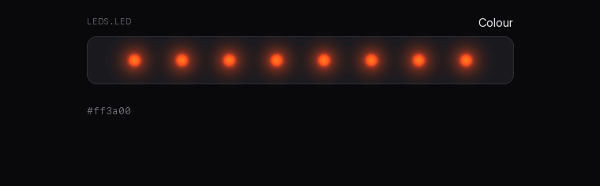
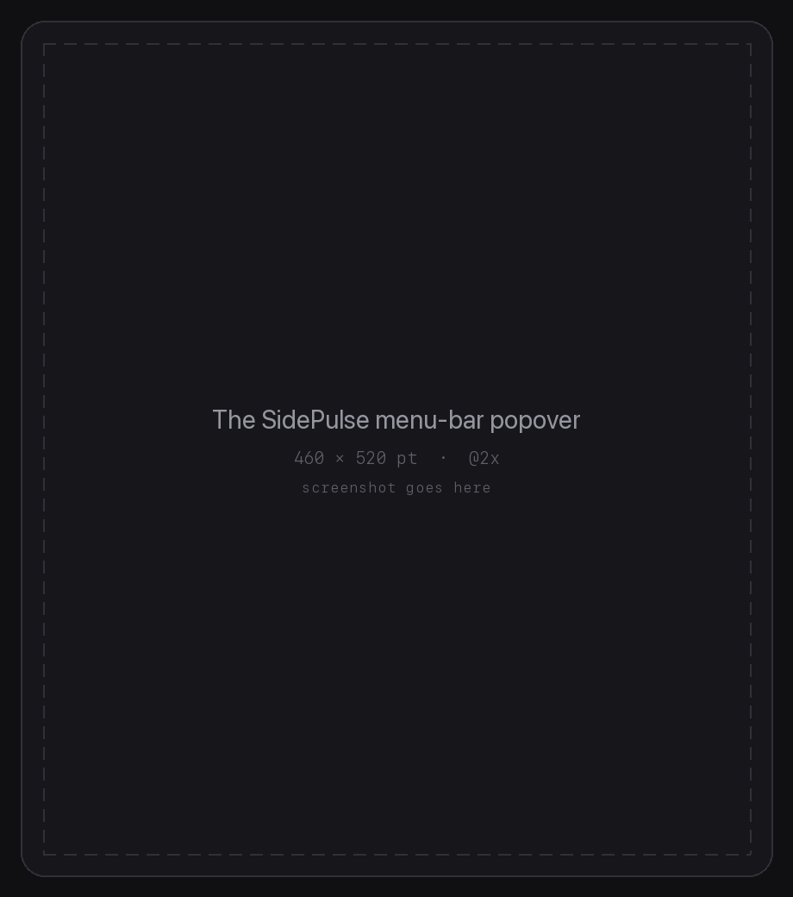
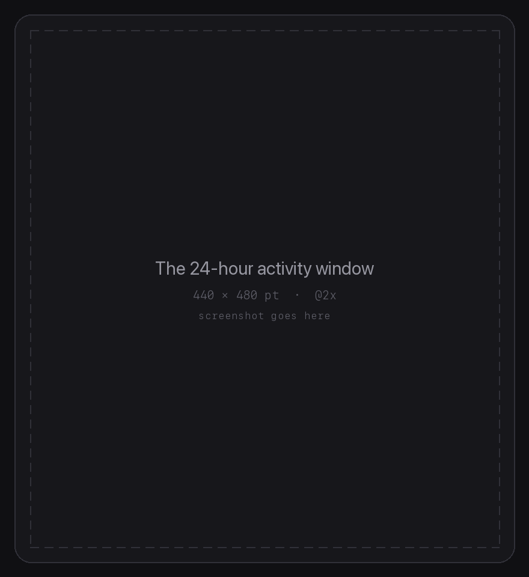

<h1 align="center">SidePulse for Mac</h1>

<p align="center">
  <b>Eight LEDs that actually stay on.</b><br>
  A menu-bar app for SidePulse Pro and SidePulse Dot — keeps the device awake, puts your
  battery, CPU, GPU and memory on the strip, and hands you the LED format when you want
  to write your own.
</p>

<p align="center">
  <a href="https://gourneau.github.io/sidepulse/">Website</a> ·
  <a href="https://github.com/gourneau/sidepulse/releases/latest">Download</a> ·
  <a href="docs/ARCHITECTURE.md">How it works</a> ·
  <a href="LEDS_FORMAT.md">LED format</a>
</p>

<p align="center">
  
</p>

<p align="center"><sub>A simulation driven by the same programs the app writes — not footage of the hardware.</sub></p>

## Install

```sh
brew tap gourneau/sidepulse
brew install --cask sidepulse
```

Or [download the notarised build](https://github.com/gourneau/sidepulse/releases/latest),
unzip, and drag it to Applications. No Gatekeeper warning.

Needs macOS 13 or later, and a [SidePulse](https://github.com/inteliwear/sidepulse) device.

## Why it exists

Leave a SidePulse Pro in a MacBook Pro's SD slot and the reader cuts power after about
three minutes of quiet. The app touches one zero-byte file every sixty seconds, which is
enough to keep the reader interested and never disturbs the animation. Measured on a real
unit: uptime past **30 minutes** with the app running, against a power cycle every **~3
minutes** without it.

When the device does restart anyway, the app notices its uptime counter go backwards and
puts your program back without being asked.

## What's in it

- **Colour, Per-LED and Presets** — Rainbow, Chase, Breathe, Sparkle, White, Off, each
  with an animated toggle and a speed slider. Everything applies live, no Apply button.
- **Modes** — the whole strip becomes a bar for battery (white), CPU (blue), GPU (purple)
  or memory (green). Enable several and it cycles between them.
- **The DSL tab** — shows the real `LEDS.LED` on the device, validates as you type against
  the controller's 512-byte / 20-line limits, and can save what you have to `INIT.LED` so
  it replays every time the device powers up. Auto-reload shows changes made by anything
  else on your Mac.
- **Plays well with other tools** — the device is a shared filesystem, so an AI agent, MCP
  server or script can drive it too. A header badge reads **Writing** when the app is
  rewriting on a timer and **Contested** when something else keeps overwriting it, and
  Observer mode stops every write so another tool can own the device.
- **Keep the Mac awake**, optionally with the lid closed, through a helper you approve once.
- **Repair** the macOS FAT-driver wedge and the "ghost card" state without rebooting.

## The format

The device mounts as a small disk. Everything the LEDs do comes from a program written to
`LEDS.LED` — no drivers, no SDK. The app's own presets are just programs:

```text
# a rolling rainbow, 90 bytes
#ff0000 #ffbf00 #80ff00 #00ff40 #00ffff #0040ff #8000ff #ff00bf
roll 1980ms linear
repeat
```

The full reference is in [`LEDS_FORMAT.md`](LEDS_FORMAT.md), and in the app under
**Format help**.

## Screenshots

|  |  |
| --- | --- |
|  |  |

<sub>Placeholders for now — see [docs/assets/README.md](docs/assets/README.md) to drop real
captures in.</sub>

## Build it yourself

```sh
git clone https://github.com/gourneau/sidepulse
cd sidepulse
swift run            # dev build, straight from SwiftPM
swift test           # the pure-logic tests
scripts/package_app.sh   # signed .app bundle in build/
```

[`docs/ARCHITECTURE.md`](docs/ARCHITECTURE.md) covers how device I/O is kept from wedging
the app, how detection works, the privileged helper, and how releases are cut.

## Credits and licence

SidePulse for Mac is by [Joshua Gourneau](https://github.com/gourneau), MIT licensed.

The **SidePulse Pro** and **SidePulse Dot** devices, their firmware and the `LEDS.LED`
format are a separate project by Peter Kuhar —
[github.com/inteliwear/sidepulse](https://github.com/inteliwear/sidepulse). This app is
independent and not endorsed by them; you'll need one of those devices for it to have
anything to talk to.
